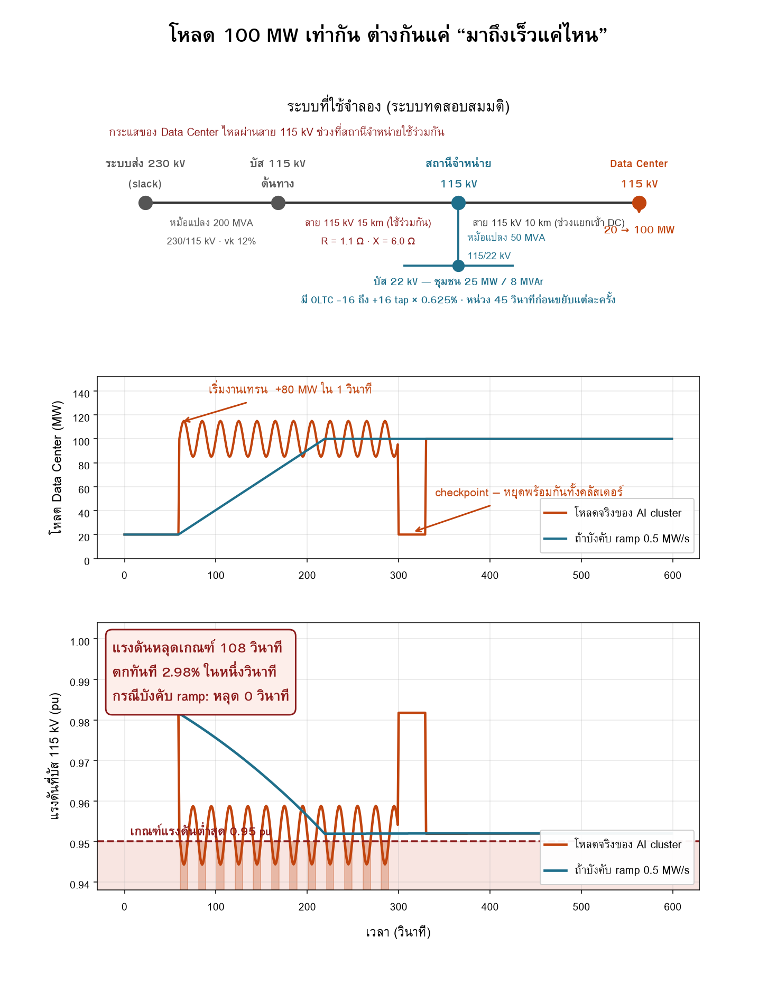

# โหลด Data Center กับ ramp rate — ทำไม "กี่เมกะวัตต์" อย่างเดียวไม่พอ

[](https://colab.research.google.com/github/GridCraft31/GridCraft/blob/main/post01-datacenter-ramp/post01_share.ipynb)



## โจทย์

โหลดที่วิศวกรระบบไฟฟ้าคุ้นเคยมี **diversity** ช่วยกลบเสมอ หมู่บ้าน 500 หลังไม่เปิดแอร์
พร้อมกันเป๊ะวินาทีเดียว โรงงานก็สตาร์ทมอเตอร์ไล่กันไปทีละตัว เราจึงคิดที่พีคแล้วเผื่อไว้หน่อยก็พอ

แต่ GPU หลายพันใบในคลัสเตอร์เดียวถูกบังคับให้เดินเป็นจังหวะเดียวกันด้วย global barrier
ของ training loop คำนวณพร้อมกัน แลกน้ำหนักพร้อมกัน แล้ววนใหม่ **diversity หายไปทั้งก้อน**

คำถาม: โหลด 100 MW เท่ากัน แต่กรณีหนึ่งมาถึงภายในหนึ่งวินาที อีกกรณีค่อย ๆ ไต่ขึ้น
ระบบไฟฟ้าเห็นต่างกันแค่ไหน

## ระบบที่จำลอง

```
ระบบส่ง 230 kV (slack)
   └ หม้อแปลง 200 MVA 230/115 kV
      └ สาย 115 kV 15 km  (ช่วงที่ใช้ร่วมกัน)
         ├ สถานีจำหน่าย 115/22 kV 50 MVA + OLTC → ชุมชน 25 MW / 8 MVAr
         └ สาย 115 kV 10 km → Data Center  20 → 100 MW
```

รันด้วย quasi-static power flow ความละเอียด 1 วินาที รวม 600 จุด (pandapower)
ไม่ต้องใช้ EMT เพราะปรากฏการณ์ที่สนใจอยู่ที่สเกลวินาทีถึงนาที ซึ่งเป็นจังหวะของ OLTC
ไม่ใช่จังหวะสวิตชิ่ง

## ผลลัพธ์

| | โหลดจริงของ AI cluster | บังคับ ramp 0.5 MW/s |
|---|---|---|
| แรงดันต่ำสุด บัส 115 kV | 0.9443 pu | 0.9519 pu |
| ตกครั้งเดียวมากสุด | 2.98 % | 0.02 % |
| เวลาที่ต่ำกว่า 0.95 pu | **108 วินาที** | **0 วินาที** |
| แรงดันต่ำสุด บัส 22 kV | 0.9564 pu | 0.9715 pu |
| OLTC ขยับ | 4 ครั้ง / 10 นาที | 4 ครั้ง / 10 นาที |

พลังงานที่ใช้เท่ากัน ค่าไฟเท่ากัน ต่างกันแค่ **"มาถึงเร็วแค่ไหน"**

จุดที่น่าสนใจคือ **ฝั่ง 22 kV ไม่หลุดเกณฑ์เลย** เพราะ OLTC ของสถานีจำหน่ายดันกลับขึ้นมาได้ทัน
การบังคับให้โหลดใหญ่ต่อที่ 115 kV จึงช่วยผู้ใช้ไฟปลายทางได้จริง แต่ไม่ได้ทำให้ปัญหาหายไป
มันย้ายปัญหาขึ้นไปไว้ที่ระบบส่ง แล้วผลักภาระที่เหลือให้อุปกรณ์ควบคุมแรงดันรับไปแทน

## วิธีรัน

**บน Google Colab** — กดปุ่มด้านบน แล้ว Runtime → Run all (ราว 1–2 นาที)

**บนเครื่องตัวเอง**
```bash
pip install pandapower matplotlib
python post01_share.py
```

ฟอนต์ไทยโหลดให้อัตโนมัติถ้าเครื่องไม่มี ไม่ต้องติดตั้งเพิ่ม

## อยากลองต่อ

ตัวแปรทั้งหมดอยู่ในบล็อกเดียวใกล้ต้นไฟล์ แก้แล้วรันใหม่ได้ทันที

- `L_SHARED` — ความยาวสายช่วงที่ใช้ร่วมกัน ลองหาว่ายาวได้ถึงกี่ km ก่อนที่สภาวะคงตัวจะไม่ผ่านเกณฑ์
- `DC_FULL` — ขนาด Data Center ลองหาว่าจุดนั้นรับได้สูงสุดกี่ MW
- `REG_DELAY` — หน่วงเวลาของ OLTC ตั้งเร็วขึ้นแล้วแลกมาด้วย tap ที่ต้องวิ่งเพิ่มเท่าไร
- เติมคาปาซิเตอร์แบงก์หรือ STATCOM เข้าไปแล้ววัดว่าช่วยได้จริงกี่เปอร์เซ็นต์

## ที่มาของตัวเลข

1. **NERC Large Loads Task Force**, *Characteristics and Risks of Emerging Large Loads*,
   July 2025 — ลักษณะโหลดและอัตราการเปลี่ยนแปลงระดับสิบถึงร้อย MW/s ตอน job start /
   checkpoint / fault recovery
   [PDF](https://www.nerc.com/globalassets/who-we-are/standing-committees/rstc/3_doc_white-paper-characteristics-and-risks-of-emerging-large-loads.pdf)
2. ค่า R ของตัวนำ **ACSR Drake 795 kcmil** — datasheet ของผู้ผลิต
3. ค่า X ของสายเหนือดิน 115 kV ขึ้นกับระยะห่างเฟสและรูปเสา ค่าที่พบทั่วไปอยู่ในช่วงราว
   0.31–0.44 Ω/km · อ้างอิงมาตรฐาน Westinghouse, *Electrical Transmission and
   Distribution Reference Book*
   **ถ้าจะใช้งานจริงควรคำนวณจากรูปเสาของระบบตัวเอง**

## ค่าที่เป็นสมมติฐาน

ผลลัพธ์ไวต่อค่าเหล่านี้ ถ้าเปลี่ยนตัวเลขในตารางด้านบนจะเปลี่ยนตาม

- `REG_DELAY` หน่วงเวลาก่อน OLTC ขยับ tap = 45 วินาที ของจริงตั้งได้ตั้งแต่หลักสิบวินาที
  ไปจนถึงหลายนาที
- `vk%` ของหม้อแปลงทั้งสองตัว = 12% เป็นค่าที่พบบ่อยในระดับแรงดันนี้
- เกณฑ์แรงดัน 0.95 pu ตามกรอบ ±5% ที่ใช้กันทั่วไป

## หมายเหตุ

ระบบทั้งหมดเป็น **ระบบทดสอบสมมติ** ไม่ใช่ข้อมูลของหน่วยงานใด
ตัวอย่างนี้ทำขึ้นเพื่อการเรียนรู้ งานจริงต้องตรวจสอบโดยวิศวกรผู้มีใบอนุญาต
