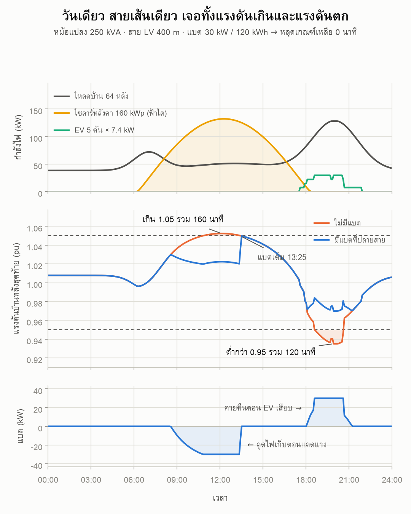
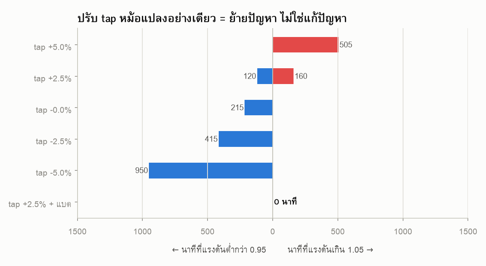

# ระบบแรงต่ำ: โซลาร์เที่ยงดันแรงดันเกิน · EV หัวค่ำดึงแรงดันตก · แบตช่วยยังไง

[](https://colab.research.google.com/github/GridCraft31/GridCraft/blob/main/post02-lv-solar-ev-bess/post02_share.ipynb)



## โจทย์

หมู่บ้านเดียวกันตอนนี้มีทั้งบ้านที่ติดโซลาร์หลังคา และบ้านที่ชาร์จรถ EV ที่บ้าน
สองอย่างนี้ใช้สายแรงต่ำเส้นเดียวกันแต่ทำตรงข้ามกัน

- **เที่ยง** แดดแรง คนไม่อยู่บ้าน โซลาร์จ่ายไฟย้อนขึ้นสาย → แรงดันปลายสาย **เกิน**
- **หัวค่ำ** แดดหมด คนกลับบ้านเปิดแอร์ เสียบรถ → แรงดันปลายสาย **ตก**

คำถาม: ปรับ tap หม้อแปลงแก้ได้ไหม และถ้าใช้แบต ต้องใหญ่แค่ไหน

## ระบบที่จำลอง

```
ระบบ 22 kV (slack)
   └ หม้อแปลง 250 kVA 22/0.4 kV · vk 4% · tap +2.5% ฝั่ง LV
      ├ สาย A  ABC 4×95 mm²  10 ช่วง × 40 m = 400 m  → แบต 30 kW / 120 kWh ที่ปลายสาย
      └ สาย B  ABC 4×95 mm²   6 ช่วง × 40 m = 240 m

บ้าน 4 หลังต่อบัส รวม 64 หลัง · ครึ่งหนึ่งติดโซลาร์ 5 kWp รวม 160 kWp
EV 5 คัน × 7.4 kW เสียบบ้านบนสาย A เวลาสุ่ม (seed คงที่)
```

รัน quasi-static power flow ทีละ 5 นาทีครบ 24 ชั่วโมง (pandapower) · แดดแบบฟ้าใส

## ผลลัพธ์

วัดที่บ้านหลังสุดท้ายของสาย A (400 m)

| | ไม่มีแบต | มีแบต 30 kW / 120 kWh |
|---|---|---|
| แรงดันสูงสุด | 1.0524 pu | 1.0497 pu |
| แรงดันต่ำสุด | 0.9350 pu | 0.9699 pu |
| เกิน 1.05 pu | **160 นาที** | **0 นาที** |
| ต่ำกว่า 0.95 pu | **120 นาที** | **0 นาที** |

ปรับ tap หม้อแปลงอย่างเดียว ไม่มีค่าไหนผ่านทั้งวัน

| tap | ต่ำกว่า 0.95 | เกิน 1.05 |
|---|---|---|
| +5.0% | 0 นาที | 505 นาที |
| +2.5% | 120 นาที | 160 นาที |
| 0% | 215 นาที | 0 นาที |
| −2.5% | 415 นาที | 0 นาที |
| −5.0% | 950 นาที | 0 นาที |



**แบตกำลังสูงกว่าไม่ได้ดีกว่าเสมอ** — 45 kW / 120 kWh ไม่ผ่าน (เกิน 80 นาที) เพราะดูดแรงตั้งแต่สาย ๆ
จนเต็มก่อนเที่ยง โจทย์นี้ขาดความจุ (kWh) ไม่ใช่กำลัง (kW)

## วิธีรัน

**บน Google Colab** — กดปุ่มด้านบน แล้ว Runtime → Run all (ราว 3–4 นาที)

**บนเครื่องตัวเอง**
```bash
pip install pandapower matplotlib
python post02_share.py
```

## อยากลองต่อ

- `N_EV` / `EV_SEED` — เพิ่มรถ หรือเปลี่ยน seed ให้เวลาเสียบเปลี่ยน
- `PV_SHARE` / `PV_KWP` — ติดโซลาร์ได้อีกกี่หลังก่อนแรงดันเกินเกณฑ์
- `BESS_KW` / `BESS_KWH` — หาขนาดแบตที่เล็กที่สุดที่ยังผ่าน
- ย้ายแบตไปกลางสาย แล้วดูว่าต้องใหญ่ขึ้นเท่าไร

## ที่มาของตัวเลข

1. **ANSI C84.1 Range A** — กรอบแรงดัน ±5% ที่ IEEE Std 1547-2018 อ้างถึง ·
   NREL, [*An Overview of Issues Related to IEEE Std 1547-2018*](https://docs.nrel.gov/docs/fy21osti/77156.pdf)
2. **IEC 60076-5 Table 1** — หม้อแปลง 25–630 kVA ค่า short-circuit impedance ขั้นต่ำ 4.0%
3. **สาย ABC 4×95 mm² อะลูมิเนียม 0.6/1 kV** — R ac 0.398 Ω/km · X 0.0868 Ω/km ·
   [datasheet APEC](https://media.mmem.com.au/Datasheets/APEC/APEC_Alum_Aerial_Bundled_4Core.pdf)
4. **แดดฟ้าใส Haurwitz (1945)** ตามที่ pvlib ใช้ ·
   [pvlib docs](https://pvlib-python.readthedocs.io/en/stable/reference/generated/pvlib.clearsky.haurwitz.html)
5. ที่ชาร์จ EV ในบ้านเฟสเดียว 32 A × 230 V ≈ 7.4 kW

## ค่าที่เป็นสมมติฐาน

- รูปโหลดบ้านรายวันเป็นรูปสังเคราะห์ ไม่ใช่ข้อมูลวัดจริง
- PV คิดจากแดดแนวราบ × performance ratio 0.8 ไม่คิดมุมเอียงแผง
- เวลาเสียบ EV สุ่มรอบ 18:30 น. · ต้องเติม 10–30 kWh
- **โมเดลเป็น 3 เฟสสมดุล** ของจริงบ้านใช้ไฟเฟสเดียว เฟสที่รับโหลดหนักจะแย่กว่าตัวเลขนี้

## หมายเหตุ

ระบบทั้งหมดเป็น **ระบบทดสอบสมมติ** ไม่ใช่ข้อมูลของหน่วยงานใด
ตัวอย่างนี้ทำขึ้นเพื่อการเรียนรู้ งานจริงต้องตรวจสอบโดยวิศวกรผู้มีใบอนุญาต
