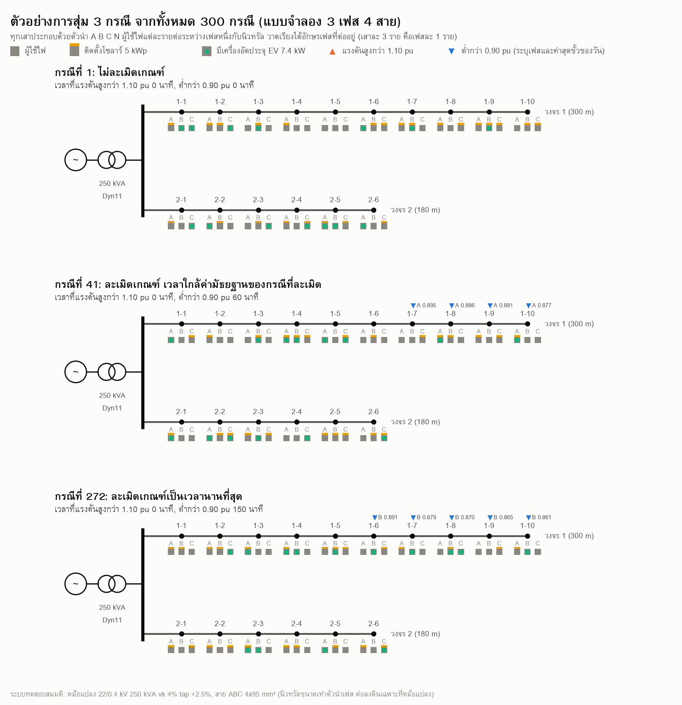
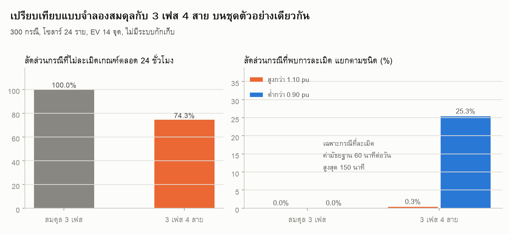
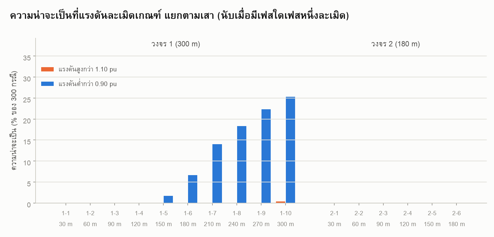
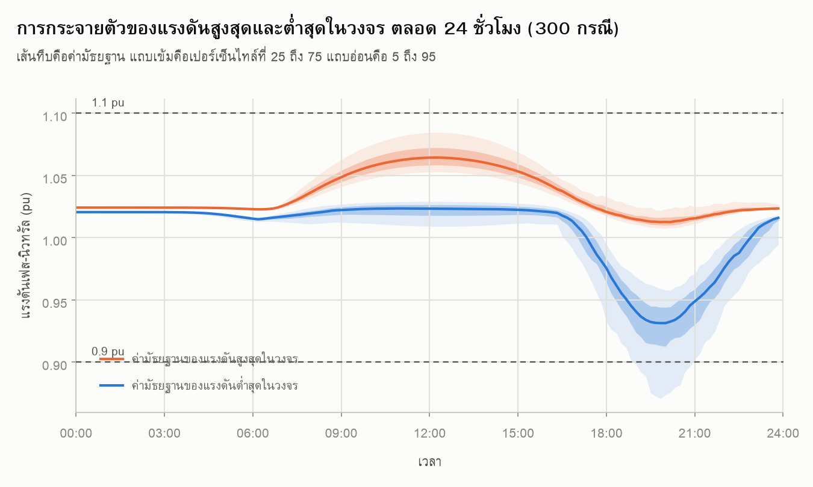

# ระบบแรงต่ำที่มีโซลาร์หลังคาและการอัดประจุ EV: Monte Carlo แบบ 3 เฟส 4 สาย

**Monte Carlo (ฉบับที่ใช้ในโพสต์)** [](https://colab.research.google.com/github/GridCraft31/GridCraft/blob/main/post02-lv-solar-ev-bess/post02_montecarlo.ipynb)
&nbsp;&nbsp;|&nbsp;&nbsp; **เคสต้นแบบ** [](https://colab.research.google.com/github/GridCraft31/GridCraft/blob/main/post02-lv-solar-ev-bess/post02_share.ipynb)



## โจทย์

ในการศึกษาผลกระทบของ DER ในระบบแรงต่ำ เราไม่ทราบล่วงหน้าว่าผู้ใช้ไฟรายใดจะติดตั้งโซลาร์
รายใดจะมีเครื่องอัดประจุ EV และรายนั้นต่ออยู่เฟสใด การประเมินด้วยกรณีเดียวจึงบอกได้เพียงว่า
"กรณีที่สมมตินั้นผ่านหรือไม่ผ่าน" ไม่ได้บอกความน่าจะเป็น

การศึกษานี้จึงสุ่มตำแหน่งผู้ติดตั้ง เฟสที่ต่อ และเวลาเริ่มอัดประจุ 300 กรณี
โดยจำนวนอุปกรณ์เท่ากันทุกกรณี แล้วเปรียบเทียบผลระหว่างแบบจำลอง 3 เฟสสมดุล
กับแบบ 3 เฟส 4 สาย บนชุดตัวอย่างเดียวกัน

## ระบบทดสอบ (สมมติ)

```
ระบบ 22 kV (slack)
   └ หม้อแปลง 250 kVA 22/0.4 kV Dyn11, vk 4%, tap +2.5% ฝั่งแรงต่ำ
      ├ วงจร 1  ABC 4×95 mm²  10 ช่วง × 30 m = 300 m
      └ วงจร 2  ABC 4×95 mm²   6 ช่วง × 30 m = 180 m

ผู้ใช้ไฟ 48 ราย เสาละ 3 ราย (เฉลี่ยเฟสละ 1 ราย) ต่อวนเฟส A B C
โหลดพีค 3 kW ต่อราย สุ่มขนาดพีค 45-100% และเลื่อนเวลาพีคด้วย sd 45 นาที
  → พีคจริงราว 2.2 kW ต่อราย, 16 kWh ต่อวัน, พีครวม 97 kW (coincidence 0.67)
โซลาร์ 24 ราย รายละ 5 kWp รวม 120 kWp (อินเวอร์เตอร์เฟสเดียว)
เครื่องอัดประจุ EV 14 จุด จุดละ 7.4 kW เฟสเดียว เริ่มอัดประจุรอบ 18:30 sd 1 ชม.
```

กรณีฐานที่ยังไม่มีโซลาร์และ EV แรงดันที่ปลายวงจรตกราว 1.8%

เกณฑ์ที่ใช้ตัดสินคือแรงดันเฟส-นิวทรัลในช่วง **บวกลบ 10% ของแรงดันระบุ ตาม IEC 60038**
นับว่าละเมิดเมื่อมีผู้ใช้ไฟรายใดรายหนึ่งออกนอกกรอบ

## ผลลัพธ์ (pandapower runpp_3ph สุ่ม 300 กรณี คำนวณทุก 10 นาที)

| | แบบจำลองสมดุล 3 เฟส | แบบจำลอง 3 เฟส 4 สาย |
|---|---|---|
| ไม่ละเมิดเกณฑ์ตลอด 24 ชม. | **100.0%** | **74.3%** |
| กรณีที่พบแรงดันต่ำกว่า 0.90 pu | 0.0% | 25.3% |
| กรณีที่พบแรงดันสูงกว่า 1.10 pu | 0.0% | 0.3% |

เฉพาะกรณีที่ละเมิด เวลาที่แรงดันต่ำกว่า 0.90 pu มีค่ามัธยฐาน 60 นาทีต่อวัน
เปอร์เซ็นไทล์ที่ 90 อยู่ที่ 120 นาที และกรณีหนักที่สุดอยู่ที่ 150 นาที

แรงดันสูงสุดที่พบตลอดการทดลองคือ 1.1004 pu ต่ำสุดคือ 0.8177 pu
กล่าวคือโซลาร์ 120 kWp บนระบบนี้ยังไม่ดันแรงดันทะลุกรอบบน
ตัวที่กำหนดขีดจำกัดคือการอัดประจุ EV ในช่วงหัวค่ำ





ความน่าจะเป็นที่จะพบแรงดันต่ำกว่าเกณฑ์ไต่ตามระยะจากหม้อแปลง เป็นศูนย์ที่ระยะไม่เกิน 120 เมตร
แล้วเพิ่มเป็น 25% ที่เสาสุดท้ายของวงจร 300 เมตร ส่วนวงจร 180 เมตร ไม่พบการละเมิดเลย



## แบบจำลองและการตรวจสอบ

ผู้ใช้ไฟแรงต่ำต่อระหว่างเฟสหนึ่งกับนิวทรัล ทั้งโหลด โซลาร์ และเครื่องอัดประจุของรายนั้น
จึงอยู่บนเฟสเดียวกัน ผลที่ตามมามีสองส่วน

1. วงจรจ่ายไฟเฟสเดียวมีอิมพีแดนซ์เป็นสองเท่าของค่าลำดับบวก เพราะกระแสไหลทั้งตัวนำเฟสและนิวทรัล
2. กระแสที่ไม่สมดุลทำให้ศักย์ที่จุดนิวทรัลลอยขึ้น แรงดันเฟส-นิวทรัลที่เสาเดียวกันจึงไม่เท่ากันทั้งสามเฟส

เนื่องจาก pandapower ไม่ได้จำลองตัวนำนิวทรัลแยก จึงคำนวณสายเป็นเมทริกซ์อิมพีแดนซ์ 4×4 แบบ Carson
(D 15 mm คาลิเบรต GMR ให้ Z1 ตรง datasheet) แล้วยุบตัวนำนิวทรัลเข้าไป ได้

```
Z1 = ค่าตาม datasheet
Z0 = 4 × Z1
```

ค่าลำดับศูนย์นี้ใช้ได้เฉพาะกรณีนิวทรัลต่อลงดินที่หม้อแปลงจุดเดียว ระบบ 3 เฟส 3 สายจะไม่ใช่ค่านี้

ในไฟล์ยังมี solver แบบ backward forward sweep 4 ตัวนำ เขียนด้วย numpy คำนวณทุกกรณีพร้อมกัน
เลือกใช้ได้ด้วย `ENGINE = "fast"` เหมาะกับการสุ่มระดับพันกรณี ผลตรงกับ pandapower ในระดับ 0.002 pu
และตรวจกับการแก้สมการ KCL ด้วย `scipy.optimize.root` แล้วต่างกันในระดับ 1e-9 pu

## วิธีรัน

**บน Google Colab**: กดปุ่มด้านบน แล้ว Runtime → Run all

**บนเครื่องตัวเอง**
```bash
pip install pandapower matplotlib
python post02_montecarlo.py
```

ค่าเริ่มต้นคือ pandapower 300 กรณี ราย 10 นาที ใช้เวลาราว 75 นาที
ตั้ง `ENGINE = "fast"` เพื่อใช้ solver ในไฟล์ จะได้ผลในเวลาไม่กี่นาที

ตัวแปรที่ปรับได้ที่ส่วนบนของไฟล์: `SEED` `N_PV` `N_EV` `PHASE_MODE` `N_DRAW` `STEP_EVERY`

## ข้อจำกัดของการศึกษา

- นิวทรัลต่อลงดินเฉพาะที่หม้อแปลง ไม่มีการต่อลงดินซ้ำตามเสา หากมี ศักย์นิวทรัลจะถูกกดลงและผลน่าจะเบาลง
- ไม่ได้คิดสายเข้าบ้าน
- รูปโหลดรายวันเป็นรูปสังเคราะห์ ไม่ใช่ข้อมูลวัดจริง
- PV คิดจากแดดแนวราบแบบท้องฟ้าแจ่มใส × performance ratio 0.8 ไม่คิดมุมเอียงแผง
- ผลขึ้นกับความละเอียดเวลาที่ใช้ ช่วงเวลาที่ละเมิดสั้นกว่าคาบการคำนวณอาจถูกมองข้าม

## ที่มาของตัวเลข

1. **IEC 60038**: แรงดันที่จุดจ่ายไฟระบบแรงต่ำ ยอมให้เบี่ยงเบนได้ บวกลบ 10% ของแรงดันระบุ
   (เกณฑ์เดียวกับที่ EN 50160 ใช้กับค่าเฉลี่ย 10 นาที)
2. **IEC 60076-5 Table 1**: หม้อแปลง 25-630 kVA ค่า short-circuit impedance ขั้นต่ำ 4.0%
3. **สาย ABC 4×95 mm² อะลูมิเนียม 0.6/1 kV**: R ac 0.398 Ω/km, X 0.0868 Ω/km,
   [datasheet APEC](https://media.mmem.com.au/Datasheets/APEC/APEC_Alum_Aerial_Bundled_4Core.pdf)
4. **แดดฟ้าใส Haurwitz (1945)** ตามที่ pvlib ใช้,
   [pvlib docs](https://pvlib-python.readthedocs.io/en/stable/reference/generated/pvlib.clearsky.haurwitz.html)
5. เครื่องอัดประจุ EV ในบ้านเฟสเดียว 32 A × 230 V ≈ 7.4 kW

---

# เคสต้นแบบ (post02_share)

ไฟล์ `post02_share.py` เป็นการศึกษาก่อนหน้าบนระบบเดียวกัน แต่ใช้ **แบบจำลอง 3 เฟสสมดุล**
กรณีเดียว ไม่ได้สุ่ม และประเมินกับกรอบที่แคบกว่าคือ บวกลบ 5%
เก็บไว้เพื่อให้เห็นว่าการวิเคราะห์กรณีเดียวให้ภาพต่างจากการสุ่มอย่างไร


วัดที่ผู้ใช้ไฟรายสุดท้ายของวงจรยาว

| | ไม่มีระบบกักเก็บ | มีระบบกักเก็บ 30 kW / 120 kWh |
|---|---|---|
| แรงดันสูงสุด | 1.0524 pu | 1.0497 pu |
| แรงดันต่ำสุด | 0.9350 pu | 0.9699 pu |
| เวลาที่สูงกว่า 1.05 pu | 160 นาที | 0 นาที |
| เวลาที่ต่ำกว่า 0.95 pu | 120 นาที | 0 นาที |

การปรับ tap หม้อแปลงอย่างเดียวไม่มีตำแหน่งใดที่ผ่านทั้งวันภายใต้กรอบ บวกลบ 5%

| tap | ต่ำกว่า 0.95 pu | สูงกว่า 1.05 pu |
|---|---|---|
| +5.0% | 0 นาที | 505 นาที |
| +2.5% | 120 นาที | 160 นาที |
| 0% | 215 นาที | 0 นาที |
| −2.5% | 415 นาที | 0 นาที |
| −5.0% | 950 นาที | 0 นาที |


⚠️ ผลด้านระบบกักเก็บในเคสต้นแบบผูกกับวิธีคุมแบบ droop ที่ดูแรงดันก่อนระบบกักเก็บทำงาน
ในจุดเวลานั้น ซึ่งเป็น feedforward หากเปลี่ยนเป็น closed-loop ผลจะเปลี่ยน
การศึกษา Monte Carlo ด้านบนจึงยังไม่รวมระบบกักเก็บ

## หมายเหตุ

ระบบทั้งหมดเป็น **ระบบทดสอบสมมติ** ไม่ใช่ข้อมูลของหน่วยงานใด
จัดทำเพื่อการเรียนรู้ การนำไปใช้งานจริงต้องตรวจสอบโดยวิศวกรผู้มีใบอนุญาต
