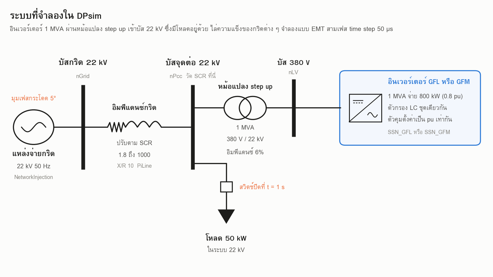

# GFL กับ GFM เมื่อความแข็งของกริดเปลี่ยนไป จำลองด้วย DPsim

[](https://colab.research.google.com/github/GridCraft31/GridCraft/blob/main/post03-gfm-vs-gfl/post03_dpsim.ipynb)



## โจทย์

มักได้ยินว่าอินเวอร์เตอร์แบบ grid-forming (GFM) ดีกว่าแบบ grid-following (GFL)
การศึกษานี้ต่ออินเวอร์เตอร์ทั้งสองแบบเข้ากับระบบเดียวกัน แล้วไล่ความแข็งของกริดด้วยค่า SCR
เพื่อดูว่าแต่ละแบบมีปัญหาตรงไหน

## ระบบทดสอบ (สมมติ)

```
แหล่งจ่ายกริด 22 kV 50 Hz
   └ อิมพีแดนซ์กริด |Zg| = 484 Ω / SCR, X/R 10
      └ บัส 22 kV (SCR คิดที่บัสนี้ บนพิกัด 1 MVA)
         ├ โหลดตัวต้านทาน 50 kW ต่อที่เวลา 1 วินาที
         └ หม้อแปลง step up 1 MVA 380 V/22 kV อิมพีแดนซ์ 6% X/R 8
            └ อินเวอร์เตอร์ 1 MVA จ่าย 800 kW ตัวประกอบกำลัง 1
               ตัวกรองชุดเดียวกันทั้งสองแบบ Lf 45 µH Cf 1.33 mF Rf 0.75 mΩ Rc 0.75 mΩ
```

- จำลองแบบ EMT สามเฟสด้วย DPsim 1.4.0 time step 50 µs
- GFL ใช้โครงข่ายและตัวกรองใน DPsim แต่วงควบคุมเขียนเองใน Python สั่ง `ControlledVoltageSource` ทุก time step
  เพราะโมเดล GFL ที่มากับ DPsim 1.4.0 (`SSN_GFL`, `GFL`, `AvVoltageSourceInverterDQ`) คุมกระแสได้ราว 13 Hz
  และไม่มี feedforward แรงดัน ช่วงไม่กี่มิลลิวินาทีแรกจึงไม่ทำตัวเป็นแหล่งจ่ายกระแส
  ตัวควบคุมที่ใช้: PLL เท่าตัวอย่างของ DPsim, วงกำลัง PI, วงกระแส 500 Hz มี decoupling และ feedforward แรงดันผ่านตัวกรอง 50 Hz
- GFM ใช้โมเดล `SSN_GFM` ตัวอย่างของ DPsim เป็นแบบแยกเกาะ ต่อกริดแล้วแกว่งทุก SCR จึงจูนวงควบคุมแรงดันใหม่
- หม้อแปลงแทนด้วยอิมพีแดนซ์ 6% อ้างฝั่ง 380 V
  เพราะเมื่อใช้ Transformer component ของ DPsim ผลบางจุดขัดกับ eigenvalue
- ขอบเสถียรภาพฝั่ง GFM: DPsim ไม่คำนวณ eigenvalue ให้ จึงเขียนสมการชุดเดียวกับในซอร์สโค้ดของ DPsim ขึ้นมาใหม่
  หาจุดทำงานแล้วคำนวณ Jacobian เชิงตัวเลข ดูเฉพาะโหมดที่ต่ำกว่า 300 Hz
- ขอบเสถียรภาพฝั่ง GFL: รัน DPsim ไล่ SCR แบบ bisection
- damping ratio ฝั่ง GFL: เขียนสมการของตัวควบคุมที่ทำเองขึ้นมาใหม่ ประมาณการหน่วงหนึ่ง time step เป็นตัวกรองอันดับหนึ่ง
  SCR ที่ damping ข้ามศูนย์ต่างจากขอบที่ไล่ใน DPsim ไม่เกินราว 3%

## ผลลัพธ์

| รูป | เรื่อง |
|---|---|
| `fig2_map_gfl.png` | แผนที่เสถียรภาพของ GFL ตามความเร็ว PLL |
| `fig3_map_gfm.png` | แผนที่เสถียรภาพของ GFM ตาม virtual reactance |
| `fig4_damping.png` | damping ratio ของโหมดที่หน่วงน้อยที่สุด ตาม SCR |
| `fig5_phase_jump.png` | มุมเฟสกริดกระโดด 5 องศา ที่ SCR 2.5 |
| `fig6_fast_pll.png` | ความถี่ที่ตัวควบคุมวัดได้ เมื่อเร่ง PLL |
| `fig7_pros_cons.png` | สรุปข้อดีและข้อจำกัด |

- GFL ที่ใช้ PLL ค่าตั้งต้นนิ่งตลอด SCR 1.8 ถึง 1000 ยิ่งเร่ง PLL ขอบยิ่งขยับไปทางกริดแข็ง
  เร็ว 4 เท่าไม่เสถียรเมื่อ SCR ต่ำกว่าราว 2.2 เร็ว 12 เท่าต่ำกว่าราว 5.5
- GFM ที่ไม่มี virtual reactance เริ่มไม่เสถียรเมื่อ SCR เกินราว 44 เพิ่มเป็น 0.02 pu ขึ้นไปก็เสถียรถึง SCR 1000
- มุมกระโดด 5 องศา ที่ SCR 2.5 GFL กระแสแทบนิ่ง (0.80 ถึง 0.86 pu) แต่กำลังตกเหลือ 0.77 pu ชั่วขณะ
  ส่วน GFM จ่ายกำลังขึ้นไป 1.06 pu กระแส 1.10 pu และกระแสยิ่งสูงเมื่อกริดแข็งขึ้น
- damping ของ GFL เพิ่มขึ้นเมื่อกริดแข็งขึ้น ส่วน GFM ลดลง GFM ที่ไม่มี virtual reactance ราว 30% บนกริดอ่อน และติดลบเมื่อ SCR เกินราว 43
- ผลที่รันใน DPsim ตกฝั่งเดียวกับเส้นขอบ

## การรัน

กดปุ่ม Colab ด้านบน แล้วรันทีละเซลล์ ค่าตั้งต้น `QUICK = True` ใช้เวลาราว 1 นาที
ถ้าตั้งเป็น `False` จะรันแผนที่ครบทุกจุด

รันบนเครื่องตัวเอง

```
pip install dpsim numpy scipy pandas matplotlib
python post03_dpsim.py
```

## ข้อจำกัด

- โมเดลใน DPsim เป็นแบบแรงดันเฉลี่ย ไม่มีการสวิตช์ และถือว่าแรงดัน DC คงที่
- อินเวอร์เตอร์ตัวเดียวต่อกับกริดอุดมคติ ค่าอิมพีแดนซ์หม้อแปลงเป็นค่าสมมติ
- ค่า SCR ที่เริ่มไม่เสถียรขึ้นกับการจูนมาก จูนต่างไปตัวเลขจะเปลี่ยน
- ทั้งสองแบบไม่มีการจำกัดกระแส
- วงควบคุม GFL เป็นแบบที่จูนเอง อินเวอร์เตอร์จริงแต่ละรุ่นตอบสนองต่างกันไป
- โค้ด GFL คำนวณตัวควบคุมใน Python ทุก time step จึงรันช้ากว่าฝั่ง GFM

## อ้างอิง

- DPsim https://github.com/sogno-platform/dpsim
- X. Gao, D. Zhou, A. Anvari-Moghaddam, F. Blaabjerg, "Stability Analysis of Grid-Following and Grid-Forming Converters Based on State-Space Modelling," IEEE Trans. Industry Applications, vol. 60, no. 3, 2024
- Y. Li, Y. Gu, T. C. Green, "Revisiting Grid-Forming and Grid-Following Inverters: A Duality Theory," IEEE Trans. Power Systems, vol. 37, no. 6, 2022, https://doi.org/10.1109/TPWRS.2022.3151851
- Y. Lin et al., "Research Roadmap on Grid-Forming Inverters," NREL/TP-5D00-73476, 2020
